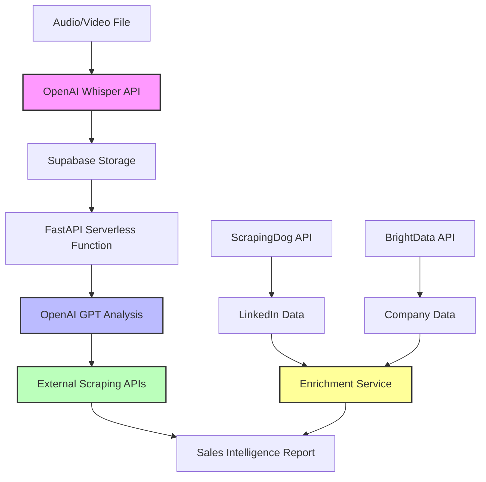

# Sales AI Assistant

A comprehensive AI-powered sales intelligence platform that processes meeting transcripts, extracts valuable insights, and enriches data with LinkedIn profiles and company website information to generate strategic, personalized sales plans.

## 🚀 New: Vercel Deployment Ready!

This application now supports **two deployment modes**:
- **Traditional Docker deployment** (full local processing)
- **Vercel serverless deployment** (cloud-native with external APIs)

## Features

- **Automated Transcription:** Convert audio/video sales meetings to text using OpenAI Whisper API
- **Advanced Sales Analysis:** Extract SPIN and BANT data, stakeholders, pain points, and opportunities
- **Data Enrichment:**
  - LinkedIn profile data extraction via external APIs
  - Company website scraping for deeper insights
- **Strategic Sales Planning:**
  - Client industry and funnel stage detection
  - Customized engagement strategies
  - Value proposition aligned with client needs
  - Stakeholder-specific approach recommendations
- **Multi-level Personalization:**
  - Industry-specific terminology and focus areas
  - Sales funnel stage adaptation
  - Decision criteria identification
  - Value driver categorization (financial, operational, strategic, risk)

## Architecture

### Vercel Serverless Architecture (New)

The application has been redesigned for Vercel with a lightweight, API-first approach:



**Key Benefits:**
- ⚡ **Instant deployment** on Vercel
- 🌍 **Global CDN** for fast performance
- 📈 **Auto-scaling** serverless functions
- 💰 **Cost-effective** pay-per-use model
- 🔒 **Secure** external API integrations

### Traditional Docker Architecture

For users who prefer local processing or have specific compliance requirements.

## Quick Start

### Option 1: Deploy to Vercel (Recommended)

1. **Prerequisites:**
   - Vercel account
   - OpenAI API key
   - Supabase account
   - ScrapingDog or BrightData API key (optional)

2. **One-click deploy:**
   [](https://vercel.com/new/clone?repository-url=https://github.com/yourusername/sales-ai-vercel)

3. **Or manual deploy:**
   ```bash
   # Clone repository
   git clone https://github.com/yourusername/sales-ai.git
   cd sales-ai
   
   # Install Vercel CLI
   npm i -g vercel
   
   # Deploy
   vercel
   ```

4. **Configure environment variables in Vercel dashboard:**
   - `OPENAI_API_KEY`
   - `SUPABASE_URL`
   - `SUPABASE_ANON_KEY`
   - `SUPABASE_SERVICE_ROLE_KEY`
   - `SCRAPINGDOG_API_KEY` (optional)
   - `BRIGHTDATA_API_KEY` (optional)

### Option 2: Docker Deployment (Traditional)

1. **Quick start with Docker:**
   ```bash
   git clone https://github.com/yourusername/sales-ai.git
   cd sales-ai
   docker-compose up -d
   ```

2. **Access at:** http://localhost:9000

## Environment Variables

### Required for Vercel Deployment

```env
# OpenAI API (for transcription and analysis)
OPENAI_API_KEY=your_openai_api_key

# Supabase (for data storage)
SUPABASE_URL=your_supabase_url
SUPABASE_ANON_KEY=your_supabase_anon_key
SUPABASE_SERVICE_ROLE_KEY=your_supabase_service_key
```

### Optional (for enhanced features)

```env
# External scraping APIs
SCRAPINGDOG_API_KEY=your_scrapingdog_key
BRIGHTDATA_API_KEY=your_brightdata_key
BRIGHTDATA_DATASET_ID=your_brightdata_dataset_id
```

## Development Setup

### For Vercel Development

1. **Clone and setup:**
   ```bash
   git clone https://github.com/yourusername/sales-ai.git
   cd sales-ai
   
   # Install dependencies
   pip install -r requirements-vercel.txt
   
   # Run locally
   vercel dev
   ```

### For Traditional Development

1. **Standard Python setup:**
   ```bash
   python -m venv venv
   source venv/bin/activate  # Windows: venv\Scripts\activate
   pip install -r requirements.txt
   python -m uvicorn app:app --reload
   ```

## Usage

### 1. Upload and Transcribe

- Upload audio/video files (up to 25MB for Vercel)
- Automatic transcription via OpenAI Whisper API
- View and edit transcripts as needed

### 2. Analyze Sales Call

- Extract stakeholders, pain points, and opportunities
- SPIN and BANT analysis using GPT-4
- Industry and funnel stage detection

### 3. Enrich with External Data

- Add LinkedIn profile URLs for stakeholder research
- Include company website for additional context
- Generate comprehensive sales intelligence report

### 4. Review Intelligence Report

The final report includes:
- **Executive Summary:** Key opportunity assessment
- **Stakeholder Analysis:** Decision-maker mapping
- **SPIN Analysis:** Situation, Problem, Implication, Need-payoff
- **BANT Qualification:** Budget, Authority, Need, Timeline
- **Value Proposition:** Customized to client needs
- **Engagement Strategy:** Multi-phase approach
- **Objection Handling:** Anticipated concerns and responses

## Project Structure

### Vercel-Compatible Structure

```
sales-ai/
├── vercel.json                 # Vercel configuration
├── requirements-vercel.txt     # Lightweight dependencies
├── api/                        # Serverless functions
│   ├── main.py                 # Main FastAPI application
│   ├── config/                 # Configuration
│   │   └── vercel_config.py    # Vercel-specific config
│   └── services/               # Service layer
│       ├── transcription_service.py  # OpenAI Whisper client
│       ├── enrichment_service.py     # External API clients
│       └── analysis_service.py       # OpenAI GPT analysis
├── static/                     # Static assets
├── templates/                  # HTML templates
└── legacy/                     # Original Docker-based code
    ├── app.py                  # Original FastAPI app
    ├── requirements.txt        # Full dependencies
    └── ...                     # Other original files
```

## Deployment Comparison

| Feature | Vercel Serverless | Docker Traditional |
|---------|-------------------|-------------------|
| **Setup Time** | < 5 minutes | 10-15 minutes |
| **Scaling** | Automatic | Manual |
| **Cost** | Pay-per-use | Fixed hosting |
| **Maintenance** | Zero | Regular updates |
| **Performance** | Global CDN | Single location |
| **Dependencies** | Lightweight | Full ML stack |
| **Audio Processing** | External API | Local processing |
| **File Size Limit** | 25MB | Unlimited |
| **Cold Start** | ~1-2 seconds | Always warm |

## API Endpoints

### Core Endpoints

- `POST /transcribe/` - Upload and transcribe audio/video
- `GET /transcripts/` - List all transcripts
- `GET /transcripts/{id}` - Get specific transcript
- `POST /transcripts/{id}/analyze` - Analyze transcript
- `POST /enrich-data/` - Enrich with external data
- `GET /health` - Health check

### Analysis Features

- SPIN methodology implementation
- BANT qualification framework
- Stakeholder relationship mapping
- Industry-specific customization
- Multi-stage sales funnel adaptation

## Contributing

1. Fork the repository
2. Create a feature branch
3. Test with both deployment methods
4. Submit a pull request

## License

MIT License - see LICENSE file for details

## Support

- 📧 Email: support@your-domain.com
- 💬 Discord: [Your Discord Server]
- 📖 Documentation: [Your Docs URL]
- 🐛 Issues: [GitHub Issues](https://github.com/yourusername/sales-ai/issues)

---

**Choose your deployment:**
- ✅ **New users:** Start with Vercel for instant deployment
- ⚙️ **Enterprise users:** Use Docker for full control
- 🔧 **Developers:** Try both and pick what fits your workflow
